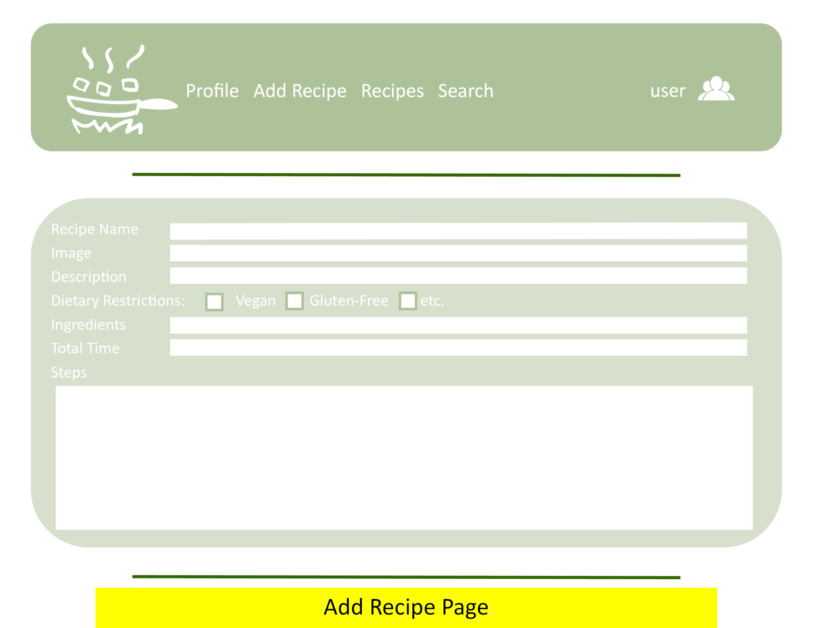
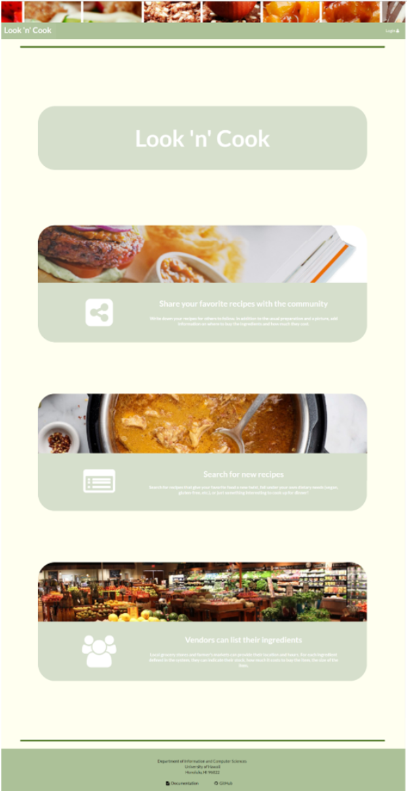
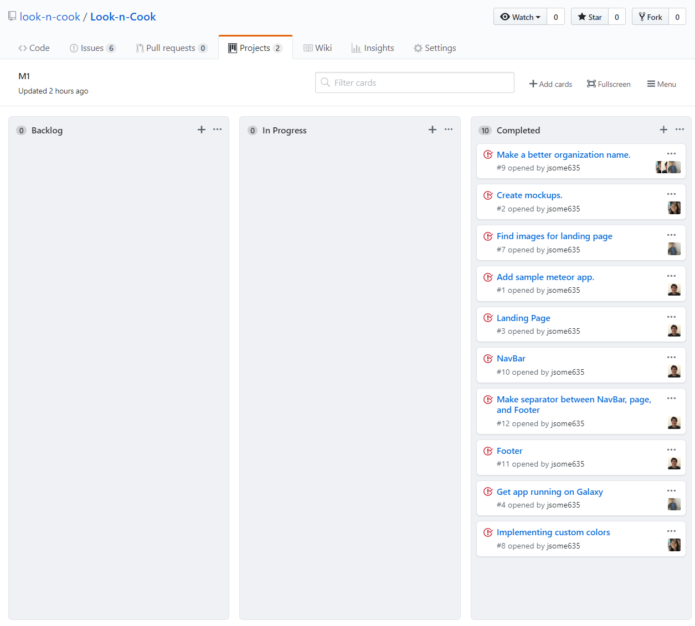

<head>
    <meta charset="UTF-8">
    <title>Look 'n' Cook</title>
    <meta name="viewport" content="width=device-width, initial-scale=1">
    <meta name="theme-color" content="#157878">
    <link rel="stylesheet" href="css/normalize.css">
    <link href='https://fonts.googleapis.com/css?family=Open+Sans:400,700' rel='stylesheet' type='text/css'>
    <link rel="stylesheet" href="css/cayman.css">
  </head>

# About Look 'n' Cook

## Goals of the Project

<ul>
  <li>Help improve the nutritional content and variety of foods eaten by students.</li>
  <li>Help UH students limit the use of vending machines or fast food products by providing tasty, realistic alternatives.</li>
</ul>

## Features Provided

This site provides UH students the ability to learn and share recipes. Trying to find the ingredients for these recipes is sometimes a hassle. So we have included a way for vendors around UH to provide information about the different ingredients that are used in the recipes. If the vendor sells the specific ingredient, they can include the price and the size of that ingredient.

# Development History
Over the course of developing Look 'n' Cook, we created Milestones that had issues that needed to be worked on before a certain due date. To manage these issues, we used GitHub projects to assign the issuses to different memebers. The following sections highlight the issues that were accomplished in each Milestone.  

## Milestone 1: Mockup Developement 

Start Date: April 3, 2018

End Date: April 12, 2018

For this Milestone, we wanted to create mockup designs of the possible pages that we plan to implement. Below are some of the designs that we came up with. 

### Mockup Pages

We were able to complete the design for our landing page and decide on a color scheme to use. We were also able to deploy our application. 

As we were implementing the user home page and profile pages, we soon realized that we would need to create a schema for our recipes. With a recipe schema, we would be able to create recipe cards to display on the user home and profile page. So we moved issues #5 and #6 to Milestone 2 and started to work on the schema for our recipes. 

Milestone 1 was implemented as <a href="https://github.com/look-n-cook/Look-n-Cook/projects/1">Look 'n' Cook GitHub Milestone M1</a>:

