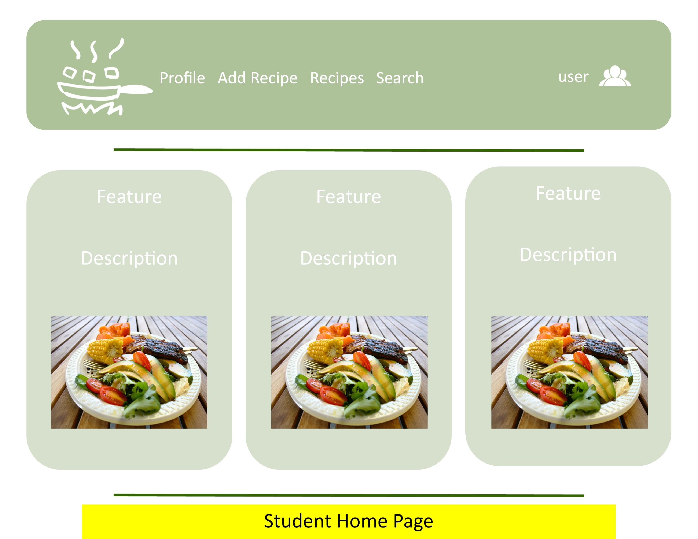

# Goals of the Project

<ul>
  <li>Help improve the nutritional content and variety of foods eaten by students.</li>
  <li>Help UH students limit the use of vending machines or fast food products by providing tasty, realistic alternatives.</li>
</ul>
# Features Provided

This site provides UH students the ability to learn and share recipes. Trying to find the ingredients for these recipes is sometimes a hassle. So we have included a way for vendors around UH to provide information about the different ingredients that are used in the recipes. If the vendor sells the specific ingredient, they can include the price and the size of that ingredient.

# Mock-Up Pages

